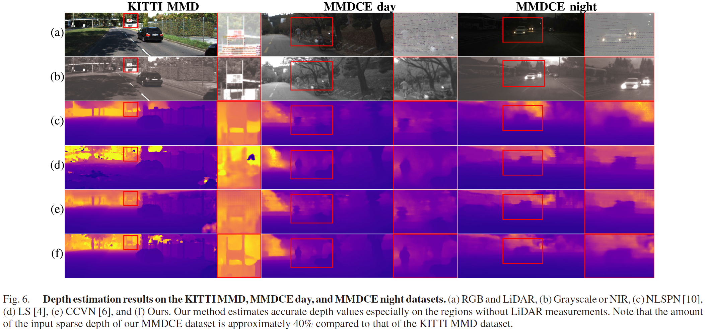

Adaptive Cost Volume Fusion Network for Multi-Modal Depth Estimation in Changing Environments
----------

#### [Jinsun Park](https://zzangjinsun.github.io/)\*, [Yongseop Jeong](https://yongseop.github.io/)\*, [Kyungdon Joo](https://vision3d-lab.unist.info/), [Donghyeon Cho](https://sites.google.com/view/hyu-cv), and In So Kweon [\* Equal Contribution]

#### _IEEE Robotics and Automation Letters (RAL), Feb 2022_
#### _IEEE International Conference on Robotics and Automation (ICRA), May 2022_


### News

 * Nov. 2024: The official implementation is released.


### Introduction


We propose an adaptive cost volume fusion algorithm, dubbed *__MMDNet__*, for multi-modal depth estimation in dynamic environments. Our method leverages measurements from multi-modal sensors to exploit their complementary characteristics, generating depth cues from each modality in the form of adaptive cost volumes using deep neural networks. The proposed adaptive cost volume takes into account sensor configurations and computational costs, addressing the imbalanced and redundant depth basis problem of conventional cost volumes. We further extend its role to a generalized depth representation and introduce a geometry-aware cost fusion algorithm. This unified and geometrically consistent depth representation facilitates accurate and efficient multi-modal sensor fusion, which is crucial for robustness in changing environments. To validate the proposed framework, we introduce a new *__Multi-Modal Depth in Changing Environments (MMDCE)__* dataset, collected using our own vehicular system equipped with RGB, NIR, and LiDAR sensors. Experimental results demonstrate that our method is robust, accurate, and reliable in diverse environmental conditions.


### Experimental Results





### Citation

Our paper is available in [IEEE Xplore](https://ieeexplore.ieee.org/abstract/document/9712358).

```
@article{park2022adaptive,
  title={Adaptive Cost Volume Fusion Network for Multi-Modal Depth Estimation in Changing Environments},
  author={Park, Jinsun and Jeong, Yongseop and Joo, Kyungdon and Cho, Donghyeon and Kweon, In So},
  journal={IEEE Robotics and Automation Letters},
  volume={7},
  number={2},
  pages={5095--5102},
  year={2022},
  publisher={IEEE}
}
```


### Dependencies

Our released implementation is tested on:

- Ubuntu 22.04
- Python 3.12 (Anaconda 24.5)
- PyTorch 2.3.1 / torchvision 0.18.1
- NVIDIA CUDA 12.1 (pytorch-cuda 12.1)
- NVIDIA RTX A6000 (48GB) x 2EA / NVIDIA RTX 4060 Ti (16GB) x 2EA


### Dataset Preparation

#### KITTI Multi-Modal Depth (KITTI MMD) Dataset

Prepare the *KITTI Multi-Modal Depth (KITTI MMD)* dataset using the *[KITTI Depth Completion (KITTIDC)](https://www.cvlibs.net/datasets/kitti/eval_depth.php)* and *[KITTI Raw (KITTIRAW)](https://www.cvlibs.net/datasets/kitti/raw_data.php)* datasets.

Stereo RGB, stereo grayscale, poses and calibrations from the *KITTIRAW* dataset are copied to the *KITTIDC* dataset.

```bash
$ cd utils
$ python prepare_KITTIMMD.py --path_dc KITTIDC_ROOT --path_raw KITTIRAW_ROOT
```

After some time, you will obtain a data structure as follows:

<details><summary><b>KITTIMMD Dataset Directory Tree (Click to Expand)</b></summary>
<p>

```
KITTIMMD_ROOT
├── devkit
│   └── ...
├── train
│   ├── 2011_09_26_drive_0001_sync
│   │   ├── calib_cam_to_cam.txt
│   │   ├── calib_imu_to_velo.txt
│   │   ├── calib_velo_to_cam.txt
│   │   ├── image_00
│   │   │   ├── timestamps.txt
│   │   │   └── data
│   │   │       ├── 0000000000.png
│   │   │       └── ...
│   │   ├── image_01
│   │   │   └── ...
│   │   ├── image_02
│   │   │   └── ...
│   │   ├── image_03
│   │   │   └── ...
│   │   ├── oxts
│   │   │   ├── dataformat.txt
│   │   │   ├── timestamps.txt
│   │   │   └── data
│   │   │       ├── 0000000000.txt
│   │   │       └── ...
│   │   └── proj_depth
│   │       ├── groundtruth
│   │       │   ├── image_00
│   │       │   │   ├── 0000000005.png
│   │       │   │   └── ...
│   │       │   ├── image_01
│   │       │   │   └── ...
│   │       │   ├── image_02
│   │       │   │   └── ...
│   │       │   └── image_03
│   │       │       └── ...
│   │       └── velodyne_raw
│   │           ├── image_00
│   │           │   ├── 0000000005.png
│   │           │   └── ...
│   │           ├── image_01
│   │           │   └── ...
│   │           ├── image_02
│   │           │   └── ...
│   │           └── image_03
│   │               └── ...
│   └── ...
├── val
│   ├── 2011_09_26_drive_0002_sync
│   │   ├── calib_cam_to_cam.txt
│   │   ├── calib_imu_to_velo.txt
│   │   ├── calib_velo_to_cam.txt
│   │   ├── image_00
│   │   │   ├── timestamps.txt
│   │   │   └── data
│   │   │       ├── 0000000000.png
│   │   │       └── ...
│   │   ├── image_01
│   │   │   └── ...
│   │   ├── image_02
│   │   │   └── ...
│   │   ├── image_03
│   │   │   └── ...
│   │   ├── oxts
│   │   │   ├── dataformat.txt
│   │   │   ├── timestamps.txt
│   │   │   └── data
│   │   │       ├── 0000000000.txt
│   │   │       └── ...
│   │   └── proj_depth
│   │       ├── groundtruth
│   │       │   ├── image_00
│   │       │   │   ├── 0000000005.png
│   │       │   │   └── ...
│   │       │   ├── image_01
│   │       │   │   └── ...
│   │       │   ├── image_02
│   │       │   │   └── ...
│   │       │   └── image_03
│   │       │       └── ...
│   │       └── velodyne_raw
│   │           ├── image_00
│   │           │   ├── 0000000005.png
│   │           │   └── ...
│   │           ├── image_01
│   │           │   └── ...
│   │           ├── image_02
│   │           │   └── ...
│   │           └── image_03
│   │               └── ...
│   └── ...
└── depth_selection
    ├── test_depth_completion_anonymous
    │   └── ...
    ├── test_depth_prediction_anonymous
    │   └── ...
    ├── val_multi_modal
    │   ├── 2011_09_26_drive_0002_sync
    │   │   ├── calib_cam_to_cam.txt
    │   │   ├── calib_imu_to_velo.txt
    │   │   ├── calib_velo_to_cam.txt
    │   │   ├── image_00
    │   │   │   └── data
    │   │   │       ├── 0000000005.png
    │   │   │       └── ...
    │   │   ├── image_01
    │   │   │   └── ...
    │   │   ├── image_02
    │   │   │   └── ...
    │   │   ├── image_03
    │   │   │   └── ...
    │   │   └── proj_depth
    │   │       ├── groundtruth
    │   │       │   ├── image_00
    │   │       │   │   ├── 0000000005.png
    │   │       │   │   └── ...
    │   │       │   ├── image_01
    │   │       │   │   └── ...
    │   │       │   ├── image_02
    │   │       │   │   └── ...
    │   │       │   └── image_03
    │   │       │       └── ...
    │   │       └── velodyne_raw
    │   │           ├── image_00
    │   │           │   ├── 0000000005.png
    │   │           │   └── ...
    │   │           ├── image_01
    │   │           │   └── ...
    │   │           ├── image_02
    │   │           │   └── ...
    │   │           └── image_03
    │   │               └── ...
    │   └── ...
    └── val_selection_cropped
        └── ...
```

</p>
</details>


Note that the root directory for *KITTI MMD (KITTIMMD_ROOT)* will be the same as that for *KITTI Depth Completion (KITTIDC_ROOT)*.

After the preparation, you should generate a JSON file containing paths to each sample.

```bash
$ cd MMDNET_ROOT/utils
$ python generate_json_KITTIMMD.py --path_kittimmd KITTIMMD_ROOT
```

This command will generate *MMDNET_ROOT/list_data/kitti_mmd.json*, which contains 32,917 samples for training, 3,426 samples for validation, and 1,000 samples for testing.

The official dataset split file *[kitti_mmd.json](./list_data/kitti_mmd.json)* is already created and contained in this repository.

Note that various input arguments are supported in *[generate_json_KITTIMMD.py](./utils/generate_json_KITTIMMD.py)*. For example, if you want to create a JSON file with fewer samples for prototyping, you can use the following command:

```bash
$ python generate_json_KITTIMMD.py --path_kittimmd KITTIMMD_ROOT --name kitti_mmd_tiny.json --num_train 32 --num_val 16 --num_test 8
```

The resulting *MMDNET_ROOT/list_data/kitti_mmd_tiny.json* will contain 32 samples for training, 16 samples for validation, and 8 samples for testing.

Please refer to *[generate_json_KITTIMMD.py](./utils/generate_json_KITTIMMD.py)* for more details.


#### Multi-Modal Depth in Changing Environments (MMDCE) Dataset

Download the *Multi-Modal Depth in Changing Environments (MMDCE)* dataset from the following link: [Google Drive](https://drive.google.com/file/d/1meauSzWsVRerJem_CAiRZ9J_KvSARr-S/view?usp=sharing)

After extracting the dataset to *MMDCE_ROOT*, you will obtain a data structure as follows:

<details><summary><b>MMDCE Dataset Directory Tree (Click to Expand)</b></summary>
<p>

```
MMDCE_ROOT
├── day
│   ├── train
│   │   ├── 2020-10-10-16-24-32
│   │   │   ├── calib.npy
│   │   │   ├── info.txt
│   │   │   ├── dep_ir1
│   │   │   │   ├── 1602314674513103008.png
│   │   │   │   └── ...
│   │   │   ├── dep_ir2
│   │   │   │   └── ...
│   │   │   ├── dep_rgb1
│   │   │   │   └── ...
│   │   │   ├── dep_rgb2
│   │   │   │   └── ...
│   │   │   ├── gt_dep_ir1
│   │   │   │   └── ...
│   │   │   ├── gt_dep_ir1_filtered
│   │   │   │   └── ...
│   │   │   ├── gt_dep_ir2
│   │   │   │   └── ...
│   │   │   ├── gt_dep_rgb1
│   │   │   │   └── ...
│   │   │   ├── gt_dep_rgb1_filtered
│   │   │   │   └── ...
│   │   │   ├── gt_dep_rgb2
│   │   │   │   └── ...
│   │   │   ├── ir1
│   │   │   │   └── ...
│   │   │   ├── ir2
│   │   │   │   └── ...
│   │   │   ├── rgb1
│   │   │   │   └── ...
│   │   │   └── rgb2
│   │   │       └── ...
│   │   └── ...
│   ├── val
│   │   ├── 2020-11-07-17-18-38
│   │   │   ├── calib.npy
│   │   │   ├── info.txt
│   │   │   ├── dep_ir1
│   │   │   │   ├── 1604737119707223295.png
│   │   │   │   └── ...
│   │   │   ├── dep_ir2
│   │   │   │   └── ...
│   │   │   ├── dep_rgb1
│   │   │   │   └── ...
│   │   │   ├── dep_rgb2
│   │   │   │   └── ...
│   │   │   ├── gt_dep_ir1
│   │   │   │   └── ...
│   │   │   ├── gt_dep_ir1_filtered
│   │   │   │   └── ...
│   │   │   ├── gt_dep_ir2
│   │   │   │   └── ...
│   │   │   ├── gt_dep_rgb1
│   │   │   │   └── ...
│   │   │   ├── gt_dep_rgb1_filtered
│   │   │   │   └── ...
│   │   │   ├── gt_dep_rgb2
│   │   │   │   └── ...
│   │   │   ├── ir1
│   │   │   │   └── ...
│   │   │   ├── ir2
│   │   │   │   └── ...
│   │   │   ├── rgb1
│   │   │   │   └── ...
│   │   │   └── rgb2
│   │   │       └── ...
│   │   └── ...
│   └── test
│       ├── 2020-10-02-17-34-35
│       │   ├── calib.npy
│       │   ├── info.txt
│       │   ├── dep_ir1
│       │   │   ├── 1601627722067240953.png
│       │   │   └── ...
│       │   ├── dep_ir2
│       │   │   └── ...
│       │   ├── dep_rgb1
│       │   │   └── ...
│       │   ├── dep_rgb2
│       │   │   └── ...
│       │   ├── gt_dep_ir1
│       │   │   └── ...
│       │   ├── gt_dep_ir1_filtered
│       │   │   └── ...
│       │   ├── gt_dep_ir2
│       │   │   └── ...
│       │   ├── gt_dep_rgb1
│       │   │   └── ...
│       │   ├── gt_dep_rgb1_filtered
│       │   │   └── ...
│       │   ├── gt_dep_rgb2
│       │   │   └── ...
│       │   ├── ir1
│       │   │   └── ...
│       │   ├── ir2
│       │   │   └── ...
│       │   ├── rgb1
│       │   │   └── ...
│       │   └── rgb2
│       │       └── ...
│       └── ...
└── night
    ├── train
    │   └── 2020-10-11-00-43-29
    │          ├── calib.npy
    │          ├── info.txt
    │          ├── dep_ir1
    │          │   ├── 1602344610899789572.png
    │          │   └── ...
    │          ├── dep_ir2
    │          │   └── ...
    │          ├── dep_rgb1
    │          │   └── ...
    │          ├── dep_rgb2
    │          │   └── ...
    │          ├── gt_dep_ir1
    │          │   └── ...
    │          ├── gt_dep_ir1_filtered
    │          │   └── ...
    │          ├── gt_dep_ir2
    │          │   └── ...
    │          ├── gt_dep_rgb1
    │          │   └── ...
    │          ├── gt_dep_rgb1_filtered
    │          │   └── ...
    │          ├── gt_dep_rgb2
    │          │   └── ...
    │          ├── ir1
    │          │   └── ...
    │          ├── ir2
    │          │   └── ...
    │          ├── rgb1
    │          │   └── ...
    │          └── rgb2
    │              └── ...
    └── test
        └── 2020-11-06-17-45-16
               ├── calib.npy
               ├── info.txt
               ├── dep_ir1
               │   ├── 1604652317523400370.png
               │   └── ...
               ├── dep_ir2
               │   └── ...
               ├── dep_rgb1
               │   └── ...
               ├── dep_rgb2
               │   └── ...
               ├── gt_dep_ir1
               │   └── ...
               ├── gt_dep_ir1_filtered
               │   └── ...
               ├── gt_dep_ir2
               │   └── ...
               ├── gt_dep_rgb1
               │   └── ...
               ├── gt_dep_rgb1_filtered
               │   └── ...
               ├── gt_dep_rgb2
               │   └── ...
               ├── ir1
               │   └── ...
               ├── ir2
               │   └── ...
               ├── rgb1
               │   └── ...
               └── rgb2
                   └── ...
```

</p>
</details>


After the preparation, you should generate a JSON file containing paths to each sample.

```bash
# For the daytime split
$ cd MMDNET_ROOT/utils
$ python generate_json_MMDCE.py --path_mmd MMDCE_ROOT/day --name mmdce_day.json

# For the nighttime split
$ cd MMDCE_ROOT/night
$ ln -s test val
$ cd MMDNET_ROOT/utils
$ python generate_json_MMDCE.py --path_mmd MMDCE_ROOT/night --name mmdce_night.json
```

The first command will generate the *MMDCE daytime (MMDCE Day)* dataset JSON file in *MMDNET_ROOT/list_data/mmdce_day.json*, which contains 4,344 samples for training, 656 samples for validation, and 876 samples for testing.

The second command will generate the *MMDCE nighttime (MMDCE Night)* dataset JSON file in *MMDNET_ROOT/list_data/mmdce_night.json*, which contains 601 samples for training and 151 samples for testing. Note that in the *MMDCE Night*, the test set serves as the validation set.

The official dataset split files *[mmdce_day.json](./list_data/mmdce_day.json)* and *[mmdce_night.json](./list_data/mmdce_night.json)* are already created and contained in this repository.


### Training

```bash
$ cd MMDNET_ROOT/src

# An example command for KITTI MMD dataset training
$ python main.py --path_kittimmd KITTIMMD_ROOT --dataset KITTIMMD --list_data ../list_data/kitti_mmd.json --method RGB-IR-LIDAR --gpus 0,1 --port 29500 --patch_width 1216 --patch_height 240 --loss 1.0*L1 --epochs 30 --batch_size 16 --lr 0.001 --decay 20,25,30 --gamma 1.0,0.2,0.04 --top_crop 100 --save_best min --save NAME_SAVE

# An example command for MMDCE Day dataset training
$ python main.py --path_mmdce MMDCE_ROOT/day --dataset MMDCE --list_data ../list_data/mmdce_day.json --method RGB-IR-LIDAR --gpus 0,1 --port 29500 --patch_width 1216 --patch_height 240 --loss 1.0*L1+1.0*L2 --epochs 30 --batch_size 8 --lr 0.001 --decay 15,20,25 --gamma 1.0,0.2,0.04 --save_best min --save NAME_SAVE

# An example command for MMDCE Night dataset training
$ python main.py --path_mmdce MMDCE_ROOT/night --dataset MMDCE --list_data ../list_data/mmdce_night.json --method RGB-IR-LIDAR --gpus 0,1 --port 29500 --patch_width 1216 --patch_height 240 --loss 1.0*L1+1.0*L2 --epochs 30 --batch_size 8 --lr 0.0002 --decay 15,20,25 --gamma 1.0,0.2,0.04 --save_best min --save NAME_SAVE --pretrain ../checkpoints/mmdceday_best.pt
```

Please refer to the *[config.py](./src/config.py)* for more options.

During the training, tensorboard logs are saved under the experiments directory. To run the tensorboard:

```bash
$ cd MMDNET_ROOT/experiments
$ tensorboard --logdir=. --bind_all --port NUM_PORT
```

Then you can access the tensorboard via *http://YOUR_SERVER_IP:NUM_PORT*


### Testing

```bash
$ cd MMDNET_ROOT/src

# An example command for KITTI MMD dataset testing
$ python main.py --path_kittimmd KITTIMMD_ROOT --dataset KITTIMMD --list_data ../list_data/kitti_mmd.json --method RGB-IR-LIDAR --gpus 0 --port 29500 --save mmdnet_kittimmd_test --test_only --pretrain PATH_TO_CHECKPOINT

# An example command for KITTI MMD dataset testing and saving prediction images
$ python main.py --path_kittimmd KITTIMMD_ROOT --dataset KITTIMMD --list_data ../list_data/kitti_mmd.json --method RGB-IR-LIDAR --gpus 0 --port 29500 --save mmdnet_kittimmd_test --test_only --pretrain PATH_TO_CHECKPOINT --save_image --save_result_only

# An example command for MMDCE Day dataset testing
$ python main.py --path_mmdce MMDCE_ROOT/day --dataset MMDCE --list_data ../list_data/mmdce_day.json --method RGB-IR-LIDAR --gpus 0 --port 29500 --save NAME_SAVE --test_only --pretrain PATH_TO_CHECKPOINT

# An example command for MMDCE Night dataset testing
$ python main.py --path_mmdce MMDCE_ROOT/night --dataset MMDCE --list_data ../list_data/mmdce_night.json --method RGB-IR-LIDAR --gpus 0 --port 29500 --save NAME_SAVE --test_only --pretrain PATH_TO_CHECKPOINT
```

To save depth and disparity prediction images, use *--save_image* and *--save_result_only* arguments together.

To obtain real depth or disparity values from the prediction images, apply the following conversion: **value = double(image) / 256.0**


### Pre-trained Models and Results

We release our pre-trained models on the [KITTI MMD](checkpoints/kittimmd_best.pt), [MMDCE Day](checkpoints/mmdceday_best.pt), and [MMDCE Night](checkpoints/mmdcenight_best.pt) datasets.

Please note that the results obtained with the released models slightly differ from those reported in the paper due to code updates.

| Type | RMSE (mm) | MAE (mm) | iRMSE (1/km) | iMAE (1/km) |
|:----:|:---------:|:---:|:-----:|:----:|
| KITTI MMD Test Set (Paper) | __673.34__ | 202.56 | 1.69 | 0.80 |
| KITTI MMD Test Set (Released) | 675.27 | __198.22__ | __1.66__ | __0.78__ |
| MMDCE Day Test Set (Paper) | 1226.2 | 610.4 | 6.9 | 3.8 |
| MMDCE Day Test Set (Released) | __1210.3__ | __595.0__ | __6.7__ | __3.7__ |
| MMDCE Night Test Set (Paper) | 1371.3 | 663.6 | __8.2__ | __4.8__ |
| MMDCE Night Test Set (Released) | __1323.1__ | __662.6__ | 9.0 | 5.3 |

We also release our prediction results on the [KITTI MMD](https://drive.google.com/file/d/1N1MULW-TQ1NQe7EgW3_neAGk2-ga78Ui/view?usp=sharing), [MMDCE Day](https://drive.google.com/file/d/1xIm-H71aHkN6EicCHY7HvOQoXQNHT-he/view?usp=sharing), and [MMDCE Night](https://drive.google.com/file/d/11AvgIJrcplO5teH8UaJSJYSz1KOcQmOW/view?usp=sharing) datasets.


### Notes

 - We cleaned and updated our original implementation for this release.
 